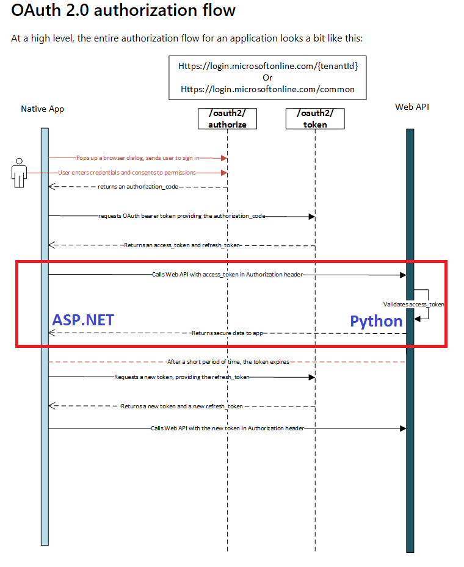

# SecureWebApp
This sample demonstrates the use of Azure Active directory authentication for ASP.NET Core and using the validated tokens to authenticate and authorize Python Web API. In the first phase, non-Javascript based authentication will be performed and in the second phase, Javascript authentication , using CORS will be added in
The scope of this project is highlighted in the following image 

 
  

  
  
